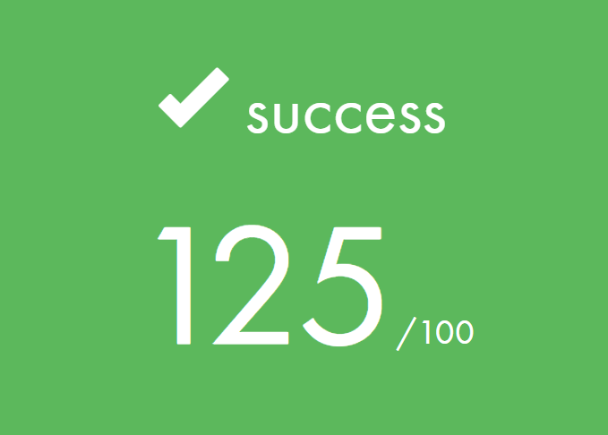

<h1 align=center>
	<b>push_swap</b>
</h1>


<p align="center">
	This project aims to introduce students to sorting algorithms and computational complexity. The task involves sorting a given list of numbers using only two stacks and a limited number of movements.
</p>

---
<div align="center">
	<h2>Final Score</h2>
	 <br>
	<h4>Completed + Bonus</h4>
	
</div>

## Table of Contents
1. [Project Overview](#project-overview)
2. [Rules](#rules)
3. [Usage](#usage)
4. [Algorithm](#algorithm)
5. [Implementation](#implementation)
6. [Bonus](#bonus)
7. [Additional Resources](#additional-resources)

---

## Project Overview

The Push swap project is a very simple and a highly straightforward algorithm project:
data must be sorted.
You have at your disposal a set of integer values, 2 stacks, and a set of instructions
to manipulate both stacks.
Your goal? Write a program in C called push_swap which calculates and displays
on the standard output the smallest program, made of Push swap language instructions,
that sorts the integers received as arguments.
Easy?
We’ll see...


-	### Mandatory Part
	1. Sorting the given list of numbers correctly.
	2. Achieving the sort with the least number of movements.

-	### Bonus
	1. Creating a checker program that takes the movements as input and verify if the movements correctly sort the given list.


---
## Rules

You have two stacks named `A` and `B`:
- `Stack A` contains a random number of unique negative and/or positive integers.
- `Stack B` is initially empty.

The goal is to sort `Stack A` in ascending order using the following operations:

- `sa` (swap a): Swap the top two elements of `Stack A`. Do nothing if there's only one or no elements.
- `sb` (swap b): Swap the top two elements of `Stack B`. Do nothing if there's only one or no elements.
- `ss`: Perform `sa` and `sb` simultaneously.
- `pa` (push a): Move the top element from `Stack B` to the top of `Stack A`. Do nothing if `Stack B` is empty.
- `pb` (push b): Move the top element from `Stack A` to the top of `Stack B`. Do nothing if `Stack A` is empty.
- `ra` (rotate a): Shift all elements of `Stack A` up by one. The top element becomes the last one.
- `rb` (rotate b): Shift all elements of `Stack B` up by one. The top element becomes the last one.
- `rr`: Perform `ra` and `rb` simultaneously.
- `rra` (reverse rotate a): Shift all elements of `Stack A` down by one. The last element becomes the first one.
- `rrb` (reverse rotate b): Shift all elements of `Stack B` down by one. The last element becomes the first one.
- `rrr`: Perform `rra` and `rrb` simultaneously.

---

## Usage

To run the program:
```sh
$ ./push_swap <list_of_integers>
```
The list can be passed as individual numbers or a single string of space-separated numbers:
```sh
$ ./push_swap 1 3 5 4 2 0 -4
```
or
```sh
$ ./push_swap "1 3 5 4 2 0 -4"
```

The program outputs the sequence of operations to sort the stack:
```sh
$ ./push_swap 0 4 2
pb
ra
pa
```

If there is an error (e.g., invalid input), it outputs:
```sh
$ ./push_swap 0 4 two
Error
```

If no parameters are passed, it does nothing and returns to the prompt
```sh
$ ./push_swap
$
```

## Algorithm

---

## Implementation

### Error Management

## Bonus

The bonus part includes creating a `checker` executable to verify the sorting instructions:

```sh
$ ./checker <list_of_integers>
```
You can then input the sorting instructions line-by-line, finishing with `Ctrl+D`:

```sh
$ ./checker 0 4 2
pb
ra
pa
OK
```

If the stack isn't sorted:
```sh
$ ./checker 0 4 2
pb
ra
KO
```

### Bonus Implementation

---

<!-- ## Additional Resources

- [Laís Arena's tester](https://github.com/laisarena/push_swap_tester)
- [Ilya Kashnitskiy's graphical interface](https://github.com/elijahkash/push_swap_gui)
- [Paula Hemsi's push_swap simulator](https://phemsi-a.itch.io/push-swap)
- [Emmanuel Ruaud's push_swap visualizer](https://github.com/o-reo/push_swap_visualizer)

---
 -->